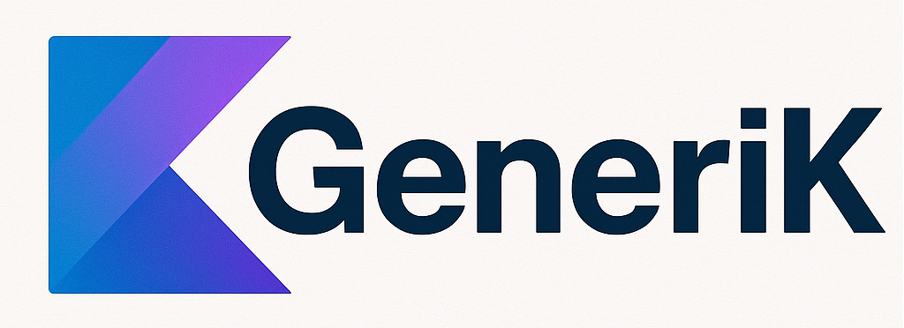

# Generik - Complex Serialization Demo

A comprehensive Kotlin project showcasing complex data model serialization using both **Gson** and **Kotlinx Serialization**.

## 🎯 Project Goals

This project serves as an **educational resource** and **generic serialization toolkit** designed to:

- **Demonstrate Generic Serialization Approaches**: Showcase different serialization strategies using both Gson and Kotlinx Serialization
- **Educational Framework**: Provide real-world examples of complex data modeling, including nested objects, collections, enums, and recursive structures
- **Generic Reflection-Based Serialization**: Explore the capabilities and limitations of custom generic serializers using Kotlin reflection
- **Comparative Analysis**: Enable developers to understand when to choose Gson vs Kotlinx Serialization vs custom generic solutions

### Prerequisites
- Java 21+ (configured with JVM Toolchain)
- Gradle 8.9 (handled by wrapper)

### 🧪 Test Coverage Summary

| Demo Class | Object Type | Serializer | Status | Test Coverage |
|------------|-------------|------------|---------|---------------|
| GsonSerializationDemo | Organization | Gson | ✅ Full | ✅ Complete |
| KotlinSerializationDemo | User | Built-in @Serializable | ✅ Full | ✅ Complete |
| ComplexGsonDemo | Organization | Gson | ✅ Full | ✅ Complete |
| ComplexKotlinxDemo | Organization | GenericSerializer | ⚠️ Limited | ✅ Error Handling |
| AdvancedComplexGsonDemo | Enterprise | Gson | ✅ Full | ✅ Complete |
| AdvancedComplexKotlinxDemo | Enterprise | GenericSerializer | ⚠️ Limited | ✅ Error Handling |

## 🚀 Future Improvements: Improving GenericSerializer Limitations

The project currently demonstrates the limitations of reflection-based serialization in modern Java environments. Future improvements could include:

- **Enhanced Reflection Access**: Investigate workarounds for Java module system restrictions
- **Alternative Serialization Strategies**: Implement code generation or annotation processing approaches
- **Hybrid Solutions**: Combine GenericSerializer with built-in Kotlinx serialization for complex objects
- **Performance Optimization**: Optimize reflection usage and caching strategies
- **Error Recovery**: Implement fallback mechanisms when reflection fails on complex nested structures 

These improvements would make the GenericSerializer more robust while maintaining its educational value in demonstrating the challenges and solutions in generic serialization.

## 📄 License

MIT License

Copyright (c) 2025 Fernando Prieto Moyano

This project is licensed under the MIT License - see the [LICENSE](LICENSE) file for details.

The MIT License is a permissive license that allows for commercial use, modification, distribution, and private use. This project is open-source and welcomes contributions from the community.
